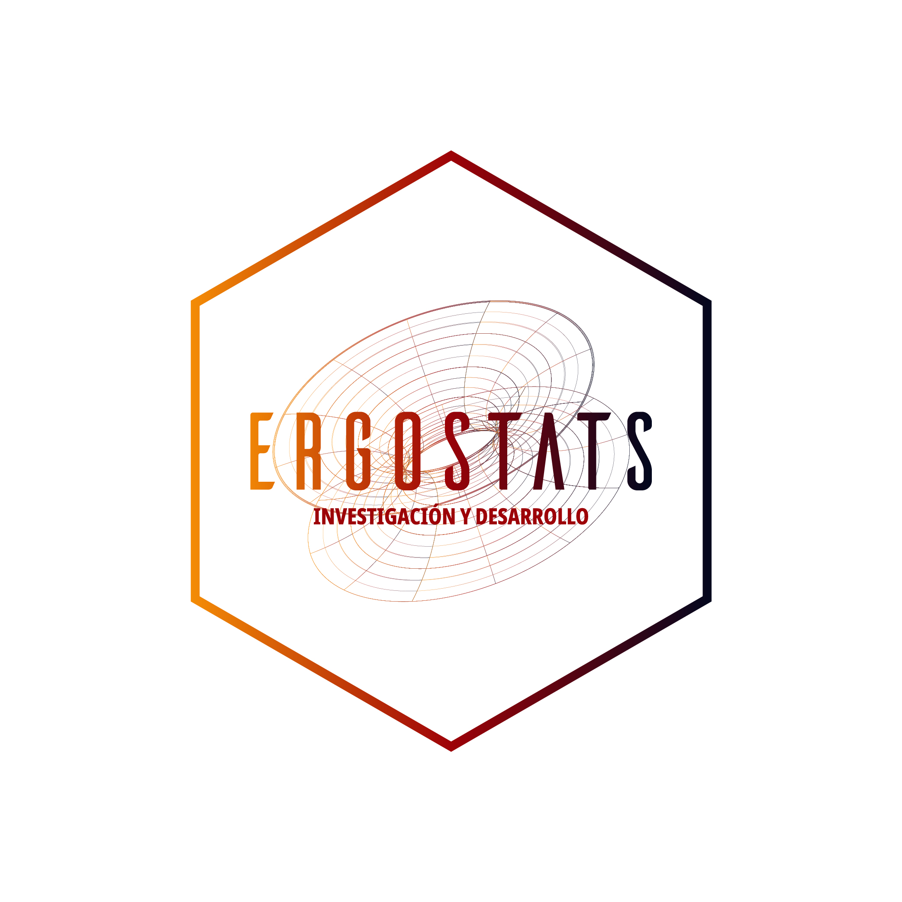

Bienvenidos al taller **Todo lo que necesitas saber para sacarle el jugo a RStudio**. Debes tener presente que existe solo una manera para aprender R, para nosotros es grato que queiras aprender con nosotros. Si los recursos de tu computador (mínimo 8GB de RAM) te son insuficentes y quieres acceder a tus proyectos *en linea* desde cualquier computador puedes utilizar **RStudio Cloud**, que requiere únicamente de una conexión de internet.

A continuación te dejamos los **enlaces de instalación** de las herramientas que emplearemos en el taller.

# Instalación de R-Base

Iniciamos con la instalación de R básico, esta instalación basta para nuestros propósitos, sin embargo hoy en día tenemos a disposición el maravilloso IDE (integrated development environment) de RStudio que nos ayuda a que la curva de aprendizaje sea más ligera para los estudiantes. 

Para instalar R-Base es necesario saber si nuestro computador es de 32 o 64 bits. Una vez resulta esta duda, procederemos a hacer clic en el siguiente enlace:

[Instalador de R desde CRAN](https://cran.r-project.org/bin/windows/base/R-4.2.0-win.exe)

Este nos dará la descarga de un archivo `.exe`. Una vez descargado, empezamos la instalación, el instalador fue desarrollado para aprovechar de manera eficiente dados los recursos de tu computador. Sin embargo tu puedes manejar las características de la instalación. Ahora, esperamos unos minutos y tendremos listo nuestro programa.

# Instalación de GIT

Vamos a proceder a la instalación de GIT, un sistema de control de versiones  que facilitará la transferencia, organización y registro de los materiales que se puedan generar no solo en el curso, sino también, en la actividad diaria usando cualquier lenguaje de programación como python, Nodejs, R, Julia etc. Para ello visitamos el enlace:

[Instalador de GIT](https://git-scm.com/download/win)

Seguimos los pasos de instalación dejando las opciones dadas por default. 

Ya estamos casi listos para empezar el taller. Nos falta la estrella de este taller.

# Instalación de RStudio

El IDE (Integrated devolpment environment) de RStudio es una herramienta potentísima que ayuda al usuario en el aprendizaje y la eficiencia a la hora de trabajar gracias a la centralización de recursos y *gadgets* que nos facilitan la vida y garantizan una investigación reproducible. Para su instalación vamos al siguiente enlace:

[Instalador de RStudio](https://download1.rstudio.org/desktop/windows/RStudio-2022.02.2-485.exe)

Seguimos la configuración por default para la ruta de instalación, salvo que se desee instalar en un directorio especifico, lo cual se recomienda con gran énfasis si tu directorio tiene caracteres especiales (ñ, espacios u otros) debido a que el programa intentará instalar dependencias a partir de la ruta que elijamos. Con ello procedemos a la instalación.

# Configurar GIT

Ya que tenemos nuestras herramientas, debemos decirle a GIT, quienes somos:

```{r eval = FALSE}

     git config --global user.mail #correo frecuente

     git config --global user.name #escribir su nombre

```
  
> Nota:  `Git Bash` es el programa default que se descarga cuando instalamos el Git.

  

